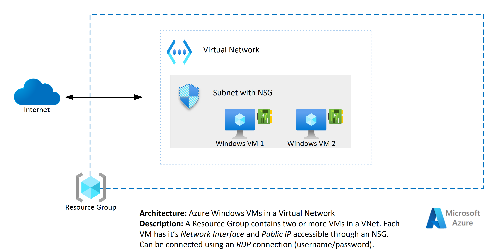

# Introduction

The Azure Virtual Machine template provisions a Resource Group that contains two or more VMs in a VNet.  Each VM has it's Network Interface and Public IP accessible through an NSG.  VMs can be connected using an RDP connection over the internet (username/password).

## Diagram

## Pre-requisites

1. An active Microsoft Azure Subscription with provisioning and service principal permissions
2. Azure DevOps Environment with Deployment capability to an Azure subscription
3. An Azure DevOps Service Connection

## Getting Started

The template contains 3 folders.

1. `/docs` - Contains the architecture diagram of the template and supporting documentation
2. `/iac` - Contains Infrastructure as Code (BICEP) and Azure Pipelines (YAML) that can be triggered from Azure DevOps to create the infrastructure in an Azure Subscription

## `docs`

1. Contains the architecture diagram of the template and supporting documentation.

## `iac`

1. `bicep`
   - This template uses [Bicep](https://learn.microsoft.com/en-us/azure azure-resource-manager/bicep/overview?tabs=bicep) for Azure resource provisioning. Bicep is Microsoft's modern declarative Infrastructure-As-Code language that borrows some syntax from modern tooling like Terraform, but is backwards and forwards compatible with Azure Resource Manager (ARM). Bicep can be converted to ARM (and ARM converted to Bicep) via the `bicep` CLI.
     - Three environments are created as part of the provisioning process: DEV, QA, and Prod. Some aspects of configuration have been exposed as parameters, which can be modified in the appropriate file under the `parameters` folder.

2. `pipelines`
   - Pipelines are designed in Azure Pipelines YAML. Pipeline parameters can be reviewed and modified under the `templates/variables` folder.
   - There is one pipeline:
     - Infrastructure provisioning (`deploy.infrastructure.yml`)
